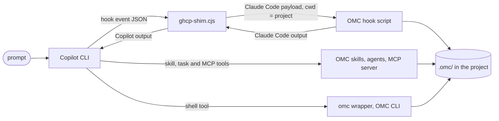

# oh-my-ghcp design

oh-my-ghcp runs [oh-my-claudecode](https://github.com/Yeachan-Heo/oh-my-claudecode) (OMC) on GitHub Copilot CLI:
OMC's skills, agents, hooks, MCP state tools and `omc` CLI, unmodified. Everything Copilot-specific lives in a thin
adapter in this repository.

## Goals and non-goals

Goals:

- The same OMC workflows on Copilot CLI as on Claude Code: magic keywords (`ralph:`, `autopilot:`, ...), persistent
  modes driven by OMC's Stop hook, OMC agents as Copilot subagents, OMC state in `.omc/`.
- OMC is not forked or patched. The installer clones a pinned upstream release; the adapter adjusts the hook contract
  and a few names around it.
- Isolation: nothing is written to `~/.claude`, and Copilot's own configuration is not changed.

Non-goals:

- Re-implementing OMC features or fixing OMC bugs here (they belong upstream).
- Claude-Code-only surfaces: the HUD/statusline and Claude Code's native `/goal`.
- Copilot in VS Code, which has a different plugin and hook model.

OMC's author scoped Copilot CLI support as "not OMC core now; a separate experimental Copilot CLI harness first"
([Yeachan-Heo/oh-my-claudecode#2651](https://github.com/Yeachan-Heo/oh-my-claudecode/issues/2651)). oh-my-ghcp is such
a separate harness. It is not affiliated with OMC's author or with GitHub.

## Why it works at all

Copilot CLI (verified with 1.0.91) loads a Claude-Code-style plugin directory with `--plugin-dir`:
`.claude-plugin/plugin.json`, `skills/*/SKILL.md`, `agents/*.md`, `hooks/hooks.json` with Claude Code event names and
`${CLAUDE_PLUGIN_ROOT}`, and `.mcp.json`. OMC's plugin therefore loads almost as is. What differs is the hook contract
(where hooks run, payload fields, which outputs Copilot honours, event order) and some names. The adapter closes those
gaps at build time (`build-overlay.cjs`) and at run time (`ghcp-shim.cjs`).

## Components

| Path | Role |
| --- | --- |
| `upstream.json` | Pinned OMC release (tag and commit). The installer refuses a tag that resolves to another commit. |
| `scripts/install.ps1`, `scripts/install.sh` | Clone the pinned OMC, install its runtime dependencies, build the plugin, install the commands. Also update and uninstall. |
| `adapter/build-overlay.cjs` | Generates the Copilot plugin directory from the OMC checkout. |
| `adapter/ghcp-shim.cjs` | Hook adapter; every OMC hook runs through it. |
| `adapter/copilot-omc`, `copilot-omc.cmd` | Launcher: `copilot --plugin-dir <plugin>` with the `bin` directory first on `PATH`. |
| `adapter/omc`, `omc.cmd` | `omc` command: OMC's CLI with `CLAUDE_CONFIG_DIR` and the session id mapped. |
| `tests/` | Offline hook replay, real-model end-to-end run, PATH helper test; see [VERIFICATION.md](VERIFICATION.md). |

Installed layout (`<COPILOT_HOME>` defaults to `~/.copilot`):

```text
<COPILOT_HOME>/oh-my-ghcp/
  omc/      unmodified OMC checkout at the pinned commit, with its runtime npm dependencies
  plugin/   generated Copilot plugin: copies of OMC's files, generated hooks.json, ghcp-shim.cjs, ghcp-shim.json,
            oh-my-ghcp.json (build info)
  bin/      copilot-omc, omc
  state/    shim bookkeeping (subagent links, host-note markers); entries older than 3 days are pruned
  claude/   OMC's CLAUDE_CONFIG_DIR, instead of ~/.claude
  tools/    esbuild, only with -RebuildCli / --rebuild-cli
```

Per project, OMC keeps its state in `.omc/`, as on Claude Code.

## Run-time flow



Persistent modes work as on Claude Code. OMC's Stop hook blocks the stop with a reason such as
`[RALPH LOOP - ITERATION 2/100] Work is NOT done...`; Copilot gives the reason to the model as the next prompt, and the
loop ends when the cancel skill clears the mode state.

## Build time: what the overlay changes

`build-overlay.cjs` copies OMC's plugin files into `plugin/` (OMC's `node_modules` is linked, not copied) and changes
only the following:

- `hooks/hooks.json`: every OMC hook command is routed through the shim with a fully quoted path. On Windows, Copilot
  runs hook commands through PowerShell, which splits OMC's `"${CLAUDE_PLUGIN_ROOT}"/scripts/...` quoting. Timeouts
  are tripled (at least 10 s) because Copilot's timeout includes its own process spawn (1 to 4 s on Windows) and drops
  the output of late hooks. Two host-note hooks go first, for SessionStart and UserPromptSubmit.
- SessionStart hooks with a matcher other than `*` (OMC's `init` and `maintenance` setup hooks) are dropped. Copilot
  ignores SessionStart matchers, so they would run on every session.
- `agents/*.md`: Claude model aliases (`model: opus|sonnet|haiku`), which Copilot rejects, are removed so agents run on
  the session model, or replaced with `--agent-model`.
- Skill, agent and command docs: `mcp__plugin_oh-my-claudecode_t__<tool>` becomes `t-<tool>`, and `ToolSearch`
  becomes a conditional `tool_search_tool` (Copilot usually lists the tools directly).
- `.mcp.json`: the MCP server gets `"cwd": "."`, which Copilot resolves against the session directory, so OMC's MCP
  state tools anchor `.omc/` in the project as on Claude Code instead of falling back to `~/.omc`.
- `ghcp-shim.json`: the subagent model policy (`--task-model` or `--task-model-map`).
- Optional `--rebuild-cli`: rebuilds OMC's CLI bundle from source. Only OMC v5.6.0 needs it (its bundle lacked
  `omc ralph`, fixed in v5.6.1).

The builder works in a staging directory and fails on any OMC hook command shape it does not know, so an OMC upgrade
that changes the hook layout cannot silently produce a broken plugin.

## Run time: hook-contract gaps and how the shim closes them

Observed on Copilot CLI 1.0.91 with OMC 5.6.1.

| Copilot CLI behaviour (compared with Claude Code) | What the shim does |
| --- | --- |
| Hooks start in the plugin root, not in the project | Runs the OMC hook with the payload's project directory as `cwd` |
| The skill tool is `skill`, with a bare skill name (`ralph`) | Passes `Skill` and `oh-my-claudecode:ralph` to OMC for OMC's own skills |
| The task tool takes `agent_type` | Adds `subagent_type` for OMC |
| Only top-level `additionalContext` is injected | Lifts `hookSpecificOutput.additionalContext` to the top level |
| For UserPromptSubmit only the last hook's context reaches the model | Each shim carries the turn's earlier hook contexts forward |
| OMC text names Claude invocations (`/oh-my-claudecode:<skill>`, `Skill(skill="oh-my-claudecode:<skill>")`, `Agent(subagent_type=...)`) in contexts, Stop reasons and deny reasons; Copilot shows them verbatim and the model copies them into calls that fail | Rewrites them to `call the skill tool with skill "<skill>"` and `the task tool (agent_type=...)` |
| The task tool's `model` selects a real Copilot model, while OMC passes Claude tiers (`opus`, `sonnet`, `haiku`) | Drops tier aliases (the subagent runs on the session model), or pins or maps them per `ghcp-shim.json` or `GHCP_TASK_MODEL`, through `updatedInput` |
| OMC writes Claude config under `CLAUDE_CONFIG_DIR` (default `~/.claude`) | Sets `CLAUDE_CONFIG_DIR` to `<COPILOT_HOME>/oh-my-ghcp/claude` unless you set it |
| PermissionRequest payloads have no `hook_event_name` | Fills it in from `--event` |
| Subagents get their own `session_id`, fire UserPromptSubmit and Stop, and never fire SubagentStart | Links a subagent to its parent through the spawn prompt, skips its UserPromptSubmit/Stop/SessionEnd hooks, reports its tool hooks under the parent session and synthesizes SubagentStart |
| A blocking Stop reason comes back as a new prompt and fires UserPromptSubmit again | Skips OMC's UserPromptSubmit hooks for that continuation prompt |
| With `-p`, SessionEnd fires right after a blocking Stop although the session continues | Skips that SessionEnd; otherwise OMC's cleanup would end the running loop |
| OMC's ultragoal guard waits for Claude Code's native `/goal` | Sets `ALLOW_ULTRAGOAL_WITHOUT_GOAL=1`, OMC's documented bypass |
| The model's shell has no `OMC_SESSION_ID` | The host note states the session id; the `omc` wrapper maps `COPILOT_AGENT_SESSION_ID` to `OMC_SESSION_ID` |
| Models take the `omc ...` steps in OMC skills (for example `omc ralph verify`) for a missing tool and skip them | The host note says `omc` is a shell command, with its absolute path when `bin` is not first on `PATH` |

The host note is one block of context per main session, added on whichever of SessionStart and UserPromptSubmit fires
first (with 1.0.91 the first prompt's UserPromptSubmit ran before SessionStart, in `-p` and interactive sessions
alike). It maps Claude names to Copilot ones (MCP tools, ToolSearch, the cancel path, the missing `/goal`), states the
OMC session id, explains the `omc` command and keeps mode-control skills in the main agent. Subagents get a one-line
note with the parent session id instead.

## Subagent model policy

By default, Claude tier hints are dropped and subagents run on the session model (`copilot --model ...`). To choose
otherwise:

- `GHCP_TASK_MODEL=<model>` in the environment (`off` disables), or the installer's `-TaskModel` / `--task-model`:
  pin every subagent.
- `-TaskModelMap` / `--task-model-map opus=...,sonnet=...,haiku=...`: map OMC's tiers to Copilot models.
- `-AgentModel` / `--agent-model`: write one model into every OMC agent definition.

An explicit model in a task call that is not a bare tier alias is kept. Models do pick one: in the end-to-end run a
gpt-5-mini session asked for `gpt-5.4` for OMC's architect (described as "Opus" in its agent definition). Each subagent
is billed for its own model, and persistent modes (ralph, autopilot, ultragoal) run several turns from one prompt, so
pin the model when cost matters.

## State and configuration decisions

- `CLAUDE_CONFIG_DIR` points to `<COPILOT_HOME>/oh-my-ghcp/claude`, so OMC's session stats, caches and config do not
  touch Claude Code's `~/.claude`. A value you set yourself is respected.
- `OMC_HOME` is not set, so OMC's global directory (`~/.omc`, or XDG directories on Linux) is shared with OMC on
  Claude Code. Redirecting it would not separate them: OMC 5.6.1's session-end worker passes its child processes an
  allowlist of environment variables without `OMC_HOME`, so it would still write `~/.omc/state`. You can set
  `OMC_HOME` yourself with that caveat.
- Project state stays in `.omc/` in the project. Add it to `.gitignore` unless your team commits it.

## Plugin loading

With 1.0.91, `copilot plugin install` does not take a local directory, and the plugin is generated per machine (it
links to the local OMC checkout). The `copilot-omc` launcher therefore passes `--plugin-dir` on each start and puts
`bin` first on `PATH`, so a globally installed `omc` from OMC's npm package cannot shadow the wrapper. Plain `copilot`
sessions are unaffected.

## Upgrading OMC

1. Set `tag` and `commit` in `upstream.json`.
2. Run the installer with `-Force` / `--force`.
3. Run `node tests/selftest-shim.cjs` and `tests/e2e-ralph.ps1`.
4. Commit only when both pass. The builder rejects unknown hook command shapes, the selftest's A/B checks (raw OMC
   compared with OMC through the shim) show new Claude-only behaviour, and its keyword checks show changed triggers;
   keep the README's keyword table and those checks in sync.

## Known limitations

- Real Copilot CLI runs were verified with Copilot CLI 1.0.91 on Windows (Windows PowerShell 5.1 and PowerShell 7). On
  Linux (WSL) the installer and the offline hook replay pass; no real Copilot run was made there. The installers warn
  on older Copilot CLI versions. macOS is untested. Details: [VERIFICATION.md](VERIFICATION.md).
- End-to-end runs with a real model cover ralph. For the other modes, the offline replay checks only that the README's
  example prompts start them (OMC's keyword marker, the skill-tool invocation and the mode state OMC creates at that
  point) and, for ultragoal, the `/goal` guard bypass.
- `omc team` (tmux workers), the HUD/statusline and VS Code are not covered.
- Windows: OMC 5.6.1's SessionEnd hook (`session-end.mjs`) usually needs more than the 300 ms that OMC's `run.cjs`
  allows it in the foreground. It timed out in all six measured runs, through the shim and run directly as on Claude
  Code, and in five of them before publishing its cleanup job. A mode still active when you exit then keeps its state
  in `.omc/state/sessions/<session id>/`; end modes with `cancelomc` before exiting. On WSL the hook finished in time
  and OMC cleared the state after its 30 s grace.
- Persistent modes run many tool calls unattended. Use `--allow-all` or `--yolo` only in repositories you trust.
