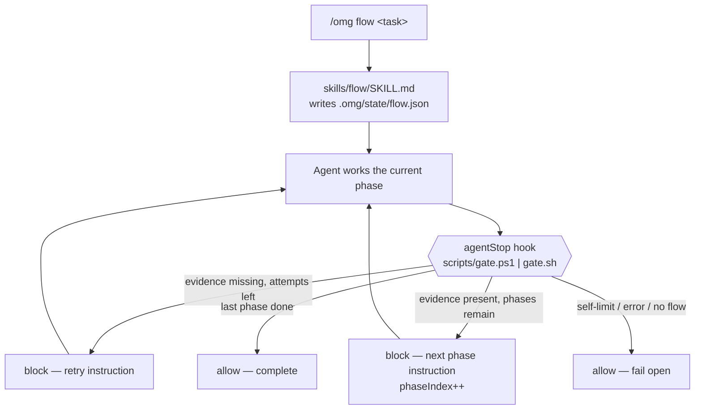

# ohmyghcp — Design

A hook-driven **workflow engine** for GitHub Copilot CLI.

## 1. Problem statement

Copilot CLI ships orchestration **primitives** but no **workflow engine**.

Verified semantics (not assumptions):

| Copilot feature | What it actually is | What it is *not* |
| --- | --- | --- |
| `autopilot` mode | A permission/autonomy level: "don't pause for approval between steps". Ends when the agent *decides* it is done. | A multi-phase state machine. No phases, no persisted state, no QA loop, no gates. |
| `plan` mode | An output style that emits a plan document before acting. | A multi-reviewer consensus planning engine. |
| `/fleet` | A fan-out parallelism primitive that spawns concurrent subagents. | A phase pipeline with ordering and gates. |
| `orchestrate` skill | Session-spawning and steering primitives. | A workflow definition with completion predicates. |

The gap this project fills: **nothing composes those primitives into a durable, evidence-gated, resumable phase pipeline.**

## 2. Why it is buildable

The decisive primitive exists. From the [Copilot hooks reference](https://docs.github.com/en/copilot/reference/hooks-reference):

> `agentStop` — The main agent finishes a turn. **Output processed: Yes — can block and force continuation.**
> `decision: "block"` forces another agent turn using `reason` as the prompt.

This is mechanically identical to the Claude Code `Stop` hook that powers `oh-my-claudecode`'s convergence loops.

Supporting primitives, all verified:

| Primitive | Event | Used for |
| --- | --- | --- |
| Force another turn | `agentStop` → `decision:"block"` + `reason` | Phase advance, retry loop |
| Block a tool call | `preToolUse` → `permissionDecision:"deny"` | Hard verification gates |
| Gate a subagent result | `subagentStop` → `block` / `modifiedResponse` | Reviewer consensus |
| Inject subagent context | `subagentStart` → `additionalContext` | Phase context propagation |
| Seed a session | `sessionStart` → `additionalContext`, `prompt` | Resume an interrupted flow |
| Per-agent model routing | `model:` in `*.agent.md` frontmatter | Cost/quality routing |

## 3. Known platform constraints

These are real and shape the design. They are not worked around by wishful thinking.

| Constraint | Impact | Mitigation |
| --- | --- | --- |
| **No `postCompact` hook** | Context compaction can silently discard in-context workflow state. | **All workflow state lives in `.omg/state/flow.json`, never only in context.** Every `agentStop` re-injects the full phase instruction via `reason`. |
| **8 consecutive `block` runaway guard** | The CLI force-ends the turn after 8 straight blocks. | Gate self-limits at 6 (`SELF_LIMIT`) using `stop_hook_active`, then returns `allow` with a resume hint. Long flows use the external runner. |
| **Shell hooks cannot rewrite prompts** (`modifiedPrompt` is SDK-only) | Cannot transparently inject state into user turns. | Use `agentStop.reason` and `sessionStart.additionalContext` instead. |
| **No in-process agent SDK** | Cannot drive the agent loop as a library. | External runner drives `copilot -p --autopilot` as a subprocess for multi-phase runs. |
| **Command `preToolUse` timeouts fail open** | A slow gate cannot reliably block. | Gate must be fast (target < 200 ms) and dependency-free. |
| **Extensions SDK is experimental** | HUD may break across releases. | HUD is strictly optional and additive; the engine never depends on it. |

## 4. Design principles

1. **Compose, never replace.** The engine drives native primitives. It does not reimplement subagents, permissions, or sessions.
2. **No name collisions with native features.** Skills are named `flow`, `converge`, `consensus`, `gate` — never `plan` or `autopilot`.
3. **Fail open, always.** Any gate error, malformed state, or unknown condition returns `allow`. A bug in this plugin must never wedge a user's session.
4. **Evidence over assertion.** A phase advances only when a declared artifact exists on disk, not because the model claims completion.
5. **State on disk, not in context.** Survives compaction, resume, and restart.
6. **Cross-platform parity.** `gate.ps1` and `gate.sh` are behaviourally identical; parity is enforced by tests.

## 5. Architecture



## 6. State schema — `.omg/state/flow.json`

```jsonc
{
  "version": 1,                       // schema version; unknown → fail open
  "status": "running",                // running | complete | failed | cancelled
  "workflow": "default",
  "phases": ["spec", "build", "verify", "review"],
  "phaseIndex": 0,
  "attempts": { "spec": 1 },          // per-phase retry counter
  "maxAttemptsPerPhase": 3,
  "consecutiveBlocks": 0,             // reset when the user submits a new prompt
  "evidence": {                       // completion predicate per phase
    "spec":   [".omg/artifacts/spec.md"],
    "build":  [".omg/artifacts/build-ok"],
    "verify": [".omg/artifacts/verify-ok"],
    "review": [".omg/artifacts/review-ok"]
  },
  "task": "…original user task…",
  "sessionId": "…",
  "updatedAt": "2026-08-24T00:00:00Z",
  "history": [{ "phase": "spec", "outcome": "advanced", "at": "…" }]
}
```

Evidence entries are repo-relative paths. A phase is satisfied when **every** listed path exists and is non-empty.

## 7. Gate contract

**Input** — `agentStop` payload on stdin:

```typescript
{ sessionId: string; timestamp: number; cwd: string; stop_hook_active?: boolean }
```

**Output** — exactly one JSON object on stdout:

```typescript
{ decision: "block", reason: string } | { decision: "allow" }
```

Stdout discipline is a hard requirement: the CLI concatenates every non-progress line and runs a single `JSON.parse`. Emitting two objects produces invalid JSON and the hook is ignored. Progress lines must be single-line `{"type":"progress","message":"…"}`.

### Decision rules

| ID | Condition | Decision |
| --- | --- | --- |
| **R1** | `.omg/state/flow.json` absent | `allow` — not in a workflow, do not interfere |
| **R2** | Evidence missing, `attempts < maxAttemptsPerPhase` | `block` — retry instruction naming the missing artifacts; `attempts++` |
| **R3** | Evidence missing, `attempts >= maxAttemptsPerPhase` | `allow` — set `status:"failed"`, escalate to human |
| **R4** | Evidence present, later phases remain | `block` — next-phase instruction; `phaseIndex++`, reset that phase's attempts |
| **R5** | Evidence present, final phase | `allow` — set `status:"complete"` |
| **R6** | `stop_hook_active` and `consecutiveBlocks >= 6` | `allow` — self-limit below the 8-block guard, persist resume hint |
| **R7** | Malformed / unreadable / unknown-version state | `allow` — fail open, warn on stderr only |
| **R8** | `status` is `complete`, `failed`, or `cancelled` | `allow` |

Rule precedence: **R7 → R1 → R8 → R6 → (R2 | R3 | R4 | R5)**. Failure and termination checks run before progress logic.

### `preToolUse` gate

| ID | Condition | Decision |
| --- | --- | --- |
| **P1** | Not in a workflow | `{}` — fall through to normal permissions |
| **P2** | `status:"running"` and tool would push/publish before the final phase | `deny` with reason |
| **P3** | Otherwise | `{}` |

## 8. Components

```
ohmyghcp/
├── plugin.json                  # manifest
├── hooks/hooks.json             # agentStop, preToolUse, subagentStart, subagentStop
├── scripts/
│   ├── gate.ps1                 # Windows state machine
│   ├── gate.sh                  # POSIX state machine
│   └── lib/                     # shared pure logic, unit-testable
├── skills/{flow,converge,consensus,gate}/SKILL.md
├── agents/*.agent.md            # planner, architect, critic, executor, verifier
├── extensions/omg-hud/extension.mjs   # optional Canvas HUD
└── docs/{DESIGN.md,TEST-PLAN.md,ATTRIBUTION.md}
```

## 9. Attribution

Skill and agent prompt content derives from MIT-licensed upstreams:

- `oh-my-claudecode` — Copyright (c) 2025 Yeachan Heo
- `oh-my-githubcopilot` — Copyright (c) 2026 jmstar85

The workflow engine (`scripts/`, `hooks/`, `extensions/`) is original work. See `ATTRIBUTION.md` for per-file provenance.
